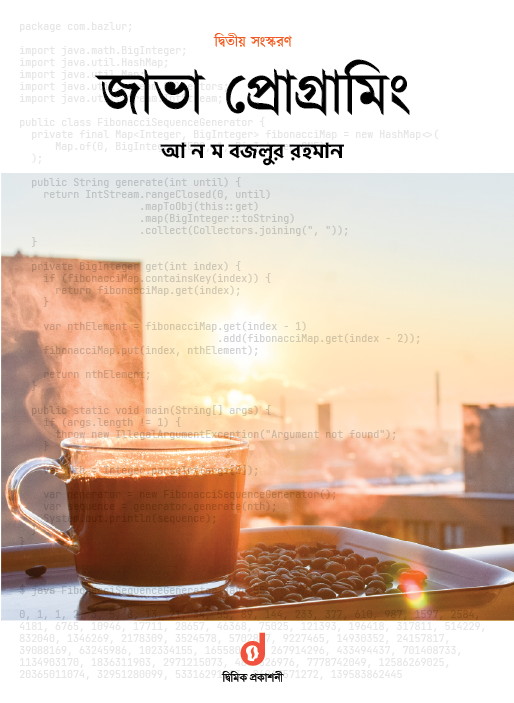

Java Programming
================

Java Programming written by **ANM Bazlur Rahman**. I read this whole books and note chapter by chapter.

All Chapter Note : 
- [Chapter 01: Java Programming Language](./chapter_01/chapter_01.md)
- [Chapter 02: Common Programming Problem](./chapter_02/chapter_02.md)
- [Chapter 03: Data Type, Operator and Expression](./chapter_03/chapter_03.md)
- [Chapter 04: Control FLow](./chapter_04/chapter_04.md)
- [Chapter 05: Array](./chapter_05/chapter_05.md)
- [Chapter 06: Object and Class](./chapter_06/chapter_06.md)
- [Chapter 07: Object Oriented Programming](./chapter_07/chapter_07.md)