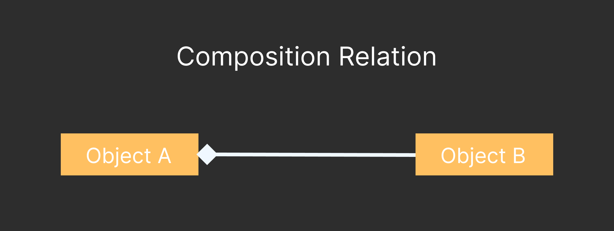
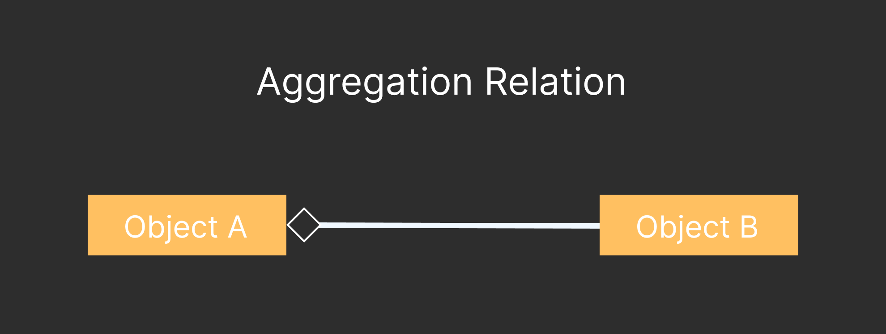

Chapter 07 : Object Oriented Programming
========================================

> 🟢 Object Oriented Programmng is a programming rules where common bulding block of programming is object.

A object has two thing : 
1. State
2. Behavior.

## Adventage of object oriented programming
Here is adventage of object oriented programming : 

1. This system is very modular. Because all object work differently each other. That's why make them differently.
2. This system make the component reusable.
3. Maintenance is easy.
4. Easy to add new feature.

A object oriented programming based on three concept : 
<details>
<summary>1. Encapsulation</summary>
This way object hide the property or data and method from outside.
</details>

<details>
<summary>2. Inheritance </summary>
This way a class inherit the others class method and feilds.
</details>

<details>
<summary>3. Polymorphism </summary>
A object can various form in different time by polymorphism.
</details>

## Application of Object Oriented Programming

**Here details about three important relation between two object :**

<details>
<summary>Composition</summary>

Think about two object `a` and `b`. If `a` is a independed object where `b` is depened on `a`. This type of relation called composition.

<br />


</details>

<details>
<summary>Aggregation Relation</summary>

Think about two object `a` and `b`, `a` and `b` are depended. `b` can be relation with one or more `a` type of object. This type of relation called aggregation relation.



</details>

<details>
<summary>Inheritance Relation </summary>

If a object inherit some feature from another object, this type of relation called inheritance.

</details>

#### ArrayList Class
```java
import java.util.ArrayList;

this is a dynamic array work like a list.

// syntax to create array : 
ArrayList<type> objectName = new ArrayList<type>();

// Example : 
ArrayList<int> objectName = new ArrayList<int>();

// add item using add method
objectName.add(Item);

// access item using get method
objectName.get(index);

// change the item set method
objectName.set(index,item);

// remove item using remove method
objectName.remove(index);

// clear the list using clear method
objectName.clear();

// access size using size method
objectName.size();
```

#### [Here is a simple mini project using class and object.](./shopingProgram/Demo.java)


## Encapsulation

> 🟢 Encapsulation means hide the field or property from outside the class.


For encapsulation java use four type of access modifier. Here is the list : 

| Modifer      |  Class    | Package    | Sub Class | Others |
|--------------|-----------|------------|-----------|--------|
| `public`     | yes       | yes        | yes       | yes    |
| `protected`  | yes       | yes        | yes       | no     |
| `default`    | yes       | yes        | no        | no     |
| `private`    | yes       | no         | no        | no     |      


> 🔵 **getter* is a method which use for accessing private or protected field.

> 🔵 **setter* is a method which use for changing value of `private` or `protected` field.

**Important things about encapsulation :**

- Always use `private` and `protected` modifier before the class field.
- Define the **getter** and **setter** for accessing the **private** or **protected** field.
- If method dose not need to accessing outside of the class then use `private` keyword for defining the method.
- `private` method and field are not inheritable. So it not possible ot overrite the private method and field.


## Abstraction

> 🟢 Abstraction means simplification the complex things. Another way, hide the complex thing from user and provide the functionality to user what is needed.

### Inheritance

**Syntax of inheritanc in simple way :**
```java
class SubClassName extends SuperClassName{
    // use extend keyword for inherit the class
}
```
